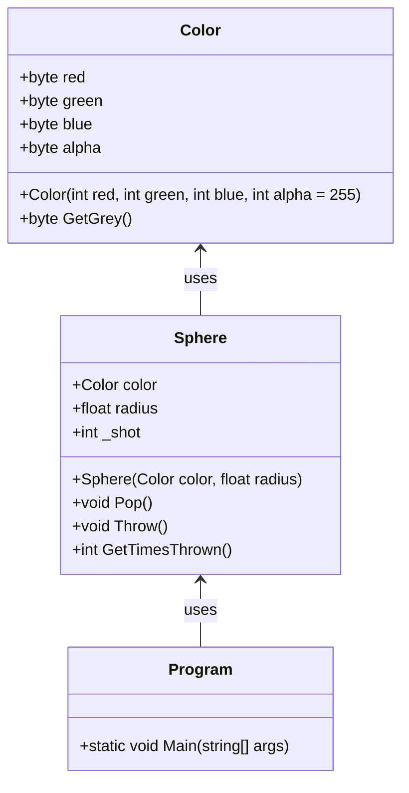

```mermaid
classDiagram
    class Color {
        +byte red
        +byte green
        +byte blue
        +byte alpha
        +Color(int red, int green, int blue, int alpha = 255)
        +byte GetGrey()
    }

    class Sphere {
        +Color color
        +float radius
        +int _shot
        +Sphere(Color color, float radius)
        +void Pop()
        +void Throw()
        +int GetTimesThrown()
    }

    class Program {
        +static void Main(string[] args)
    }

    Color <-- Sphere : uses
    Sphere <-- Program : uses
```